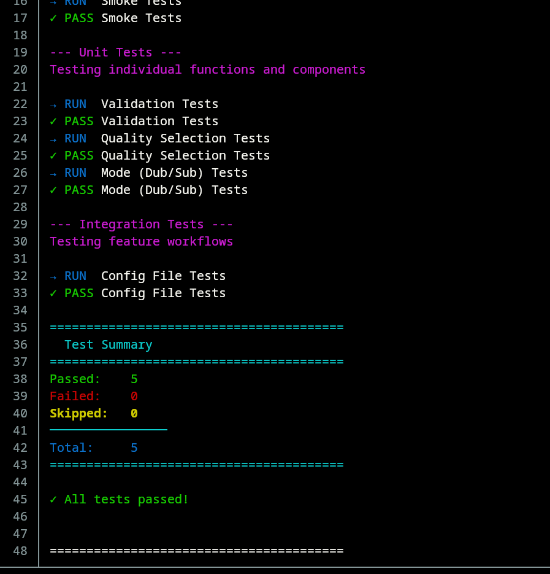

# animex

**Professional CLI tool for streaming anime**

Stream and download anime directly from your terminal with powerful features and quality control.

🌐 **[animex.jayeshpuri.me](https://animex.jayeshpuri.me)** - Official website

## Quick Install

```bash
git clone "https://github.com/Jayesh-Dev21/animex.git"
cd animex
sudo cp animex /usr/local/bin
cd .. && rm -rf animex
```

## Usage

```bash
# Search and watch
animex naruto

# Download episode
animex -d -e 5 "one piece"

# Continue from history
animex -c

# Set quality
animex -q 1080 "jujutsu kaisen"
```

## Features

- Watch anime in sub or dub
- Quality selection (360p - 1080p)
- Download episodes
- Watch history tracking
- Multiple video player support (mpv, vlc, iina, syncplay)
- Auto-skip intro/outro with ani-skip
- Configurable via config file or environment variables

## Dependencies

- grep, sed, curl
- fzf - Interactive menu
- mpv, vlc, or iina - Video player
- aria2c - Download manager (optional)
- yt-dlp - m3u8 downloader (optional)
- ffmpeg - m3u8 fallback (optional)

## Configuration

Config file: `~/.local/state/animex/config`

```bash
# Edit config
animex --config
```

## Testing

```bash
cd tests
./run-tests.sh
```

Also has automated tests via Github-Actions, with every commit, and then the logs are stored with the commit hash --> 


## License

GNU General Public License v3.0

---

Created by [Jayesh-Dev21](https://github.com/Jayesh-Dev21)
